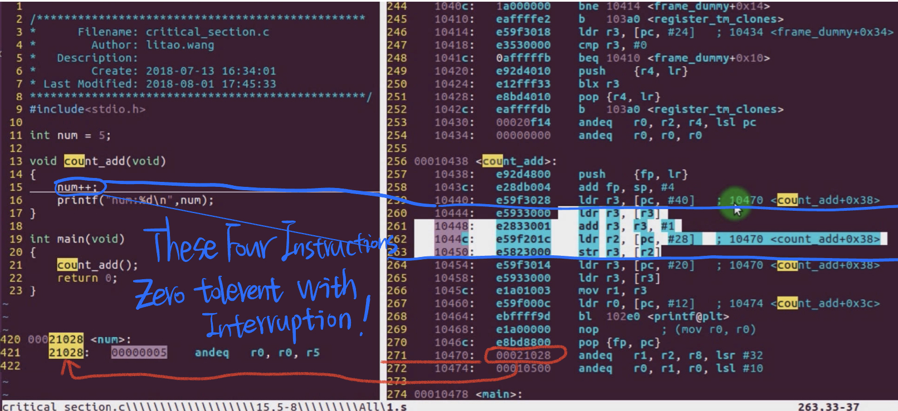
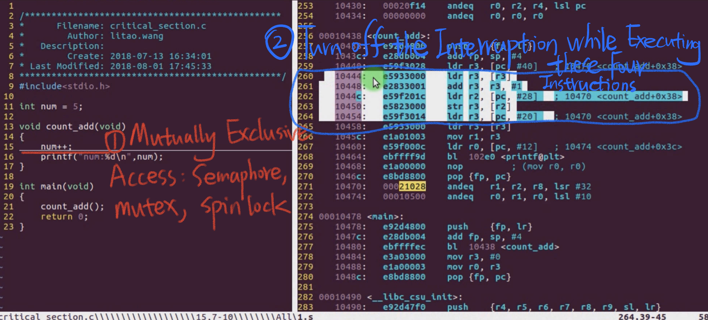
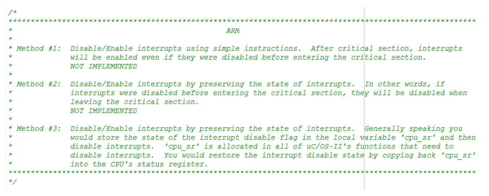
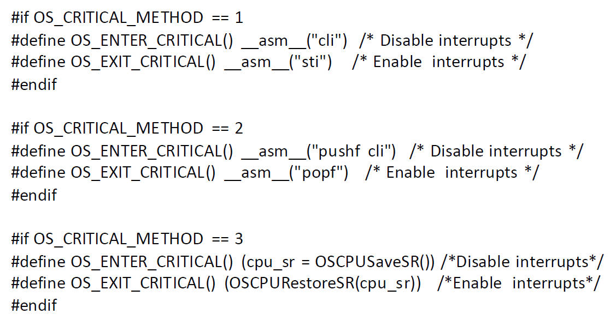
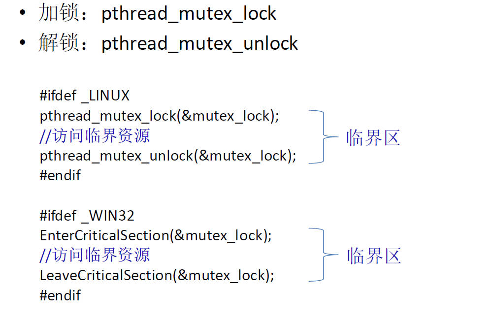

# 9.7 Critical Sections and Critical Resources
# 9.7 临界区和临界资源

How to safely use non-reentrant functions in a multitasking environment.

Critical Sections and Critical Resources do not aim at tackling interruptions directly. They are concepts and mechanisms used in concurrent and multi-threaded programming to manage shared resources and ensure that access to shared resources(global Variable) is controlled to prevent data corruption or race conditions. While they are related to synchronization and can indirectly impact how interruptions are handled, they primarily focus on managing access to shared data among multiple threads or processes.

## Critical Resources

• A shared resource that is only allowed to be used by one process at a time  
• Mutually exclusive access, only one process is allowed to access at the same time  
• Examples: printers, global variables, static variables, buffers  

### Example: a Non-reentrant Function

```bash
arm-linux-gnueabi-objdump -D a.out > 1.s
```



#### Two way to solve the Non-reentrant Function Access



## Implementation of Critical Section

### Operation primitives

1. **EnterCriticalSection():**
   - This operation primitive is used to request access to a critical section.
   - When a thread or process invokes `EnterCriticalSection()`, it attempts to gain exclusive access to the shared resource.
   - If another thread or process already holds the lock to the critical section, the calling thread may be blocked or put in a queue until it can acquire the lock.
   - Once a thread successfully acquires the lock, it can proceed to execute the code within the critical section.
2. **LeaveCriticalSection():**
   - This operation primitive is used to release access to a critical section.
   - After a thread has finished executing the code in the critical section, it should invoke `LeaveCriticalSection()` to release the lock.
   - Releasing the lock allows other threads or processes that are waiting to enter the critical section to do so.

### Method to Realize

1. #### Mutually exclusive access: 

   - **Semaphore:** A semaphore is a synchronization primitive that can be used to control access to a critical section. It maintains a counter, and threads can increment or decrement this counter. When the counter reaches zero, subsequent threads attempting to decrement it will block. This can be used to limit the number of threads that can access the critical section concurrently.
   - **Mutex (Mutual Exclusion Lock):** A mutex is a synchronization mechanism that allows only one thread at a time to enter a critical section. When a thread acquires a mutex, it has exclusive access to the protected resource until it releases the mutex.
   - **Spin Lock:** A spin lock is a type of lock that repeatedly checks for the availability of a resource in a tight loop until it becomes available. This means that a thread "spins" while waiting for the lock to become available, which can be computationally expensive. Spin locks are more efficient when critical sections are expected to be held for very short durations.

2. ####  Turn off interrupts  

   In some systems, it is possible to disable interrupts to ensure mutual exclusion. This method is typically used in embedded systems or when dealing with very low-level hardware access. However, it's a dangerous approach because it can disrupt the normal functioning of the system and should be used with caution.

### Code Examples

#### 1. Semaphore Example in C:

```c
#include <stdio.h>
#include <pthread.h>
#include <semaphore.h>

// Shared resource (a simple counter)
int counter = 0;

// Semaphore to control access to the critical section
sem_t semaphore;

// Function to increment the counter within the critical section
void *increment_counter(void *arg) {
    for (int i = 0; i < 1000000; i++) {
        // Wait on the semaphore (enter critical section)
        sem_wait(&semaphore);
        counter++;
        // Signal the semaphore (exit critical section)
        sem_post(&semaphore);
    }
    return NULL;
}

int main() {
    // Initialize the semaphore
    sem_init(&semaphore, 0, 1);

    pthread_t thread1, thread2;

    // Create two threads to concurrently increment the counter
    pthread_create(&thread1, NULL, increment_counter, NULL);
    pthread_create(&thread2, NULL, increment_counter, NULL);

    // Wait for both threads to finish
    pthread_join(thread1, NULL);
    pthread_join(thread2, NULL);

    // Print the final value of the counter
    printf("Counter: %d\n", counter);

    // Destroy the semaphore
    sem_destroy(&semaphore);

    return 0;
}
```
2. #### Mutex Example

```c
#include <stdio.h>
#include <pthread.h>

// Shared resource (a simple counter)
int counter = 0;

// Mutex to protect the critical section
pthread_mutex_t mutex = PTHREAD_MUTEX_INITIALIZER;

// Function to increment the counter within the critical section
void *increment_counter(void *arg) {
    for (int i = 0; i < 1000000; i++) {
        // Lock the mutex (enter critical section)
        pthread_mutex_lock(&mutex);
        counter++;
        // Unlock the mutex (exit critical section)
        pthread_mutex_unlock(&mutex);
    }
    return NULL;
}

int main() {
    pthread_t thread1, thread2;

    // Create two threads to concurrently increment the counter
    pthread_create(&thread1, NULL, increment_counter, NULL);
    pthread_create(&thread2, NULL, increment_counter, NULL);

    // Wait for both threads to finish
    pthread_join(thread1, NULL);
    pthread_join(thread2, NULL);

    // Print the final value of the counter
    printf("Counter: %d\n", counter);

    return 0;
}
```

3. #### Spin Lock Example in C Language

Note: Spin locks are typically implemented using atomic operations, and the C standard library doesn't provide a built-in spin lock type. Below is a simplified example using a busy-wait loop:

```c
#include <stdio.h>
#include <pthread.h>
#include <stdatomic.h>

// Shared resource (a simple counter)
// counter represents a shared resource (a simple counter) that multiple threads will increment concurrently.
int counter = 0;

// Atomic flag to implement a spin lock
// atomic_flag spin_lock is used to implement a spin lock. ATOMIC_FLAG_INIT initializes it to the clear (unlocked) state. This flag will be used to protect access to the counter within a critical section.
atomic_flag spin_lock = ATOMIC_FLAG_INIT;

// Function to increment the counter within the critical section
//increment_counter is a function that each thread will execute.
//It loops 1,000,000 times, simulating some work within the critical section.
//The critical section is protected by a spin lock.
//atomic_flag_test_and_set(&spin_lock) checks if the spin lock is already set (locked). If it is, the thread spins in a loop, repeatedly checking until the lock is cleared (unlocked) by another thread. This is the spinning part of a spin lock.
//Once the lock is acquired (no other thread holds it), the thread increments the counter within the critical section.
//After completing the critical section work, atomic_flag_clear(&spin_lock) releases the lock, allowing other threads to acquire it.
void *increment_counter(void *arg) {
    for (int i = 0; i < 1000000; i++) {
        // Spin until the lock is acquired (enter critical section)
        while (atomic_flag_test_and_set(&spin_lock)) { }
        counter++;
        // Release the lock (exit critical section)
        atomic_flag_clear(&spin_lock);
    }
    return NULL;
}

int main() {
    pthread_t thread1, thread2;

    // Create two threads to concurrently increment the counter
    pthread_create(&thread1, NULL, increment_counter, NULL);
    pthread_create(&thread2, NULL, increment_counter, NULL);

    // Wait for both threads to finish
    pthread_join(thread1, NULL);
    pthread_join(thread2, NULL);

    // Print the final value of the counter
    printf("Counter: %d\n", counter);

    return 0;
}
//In the main function, we create two threads (thread1 and thread2) using pthread_create. These threads will both execute the increment_counter function concurrently, attempting to increment the shared counter.
//We then wait for both threads to finish using pthread_join.
//Finally, we print the final value of the counter, which should be approximately 2,000,000 (1,000,000 from each thread).
//the critical resource is to protect when a function is access the shared resources, it will not be interruptted by others, causing weird outcomes.
```

4. #### Disabling Interrupts (Not Recommended in C):

Note: Disabling interrupts is platform-specific and typically not recommended in user-level C programming. It's often used in kernel-level programming for certain operations. Here's a simplified example, but keep in mind that this should be used with extreme caution:

```c
#include <stdio.h>
#include <stdint.h>

// Shared resource (a simple counter)
int counter = 0;

// Function to increment the counter without interrupts (not recommended)
void increment_counter_without_interrupts() {
    // Disable interrupts (platform-specific)
    asm("cli");

    // Critical section: increment the counter
    counter++;

    // Enable interrupts (platform-specific)
    asm("sti");
}

int main() {
    // Call the function to increment the counter without interrupts
    increment_counter_without_interrupts();
    
    // Print the final value of the counter
    printf("Counter: %d\n", counter);

    return 0;
}
```

5. #### Set up Critical Section

The `EnterCriticalSection()` and `LeaveCriticalSection()` functions are typically associated with Microsoft Windows and are used for managing critical sections in multithreaded Windows programs. They are part of the Windows API for synchronization. Below is an example of how to use these functions in a Windows C++ program.

```cpp
#include <iostream>
#include <windows.h>

// Shared resource (a simple counter)
int counter = 0;

// Critical section object
CRITICAL_SECTION cs;

// Function to increment the counter within the critical section
void increment_counter() {
    EnterCriticalSection(&cs);  // Enter the critical section

    // Critical section: increment the counter
    counter++;

    LeaveCriticalSection(&cs);  // Leave the critical section
}

int main() {
    // Initialize the critical section
    InitializeCriticalSection(&cs);

    // Create two threads to concurrently increment the counter
    HANDLE thread1 = CreateThread(NULL, 0, (LPTHREAD_START_ROUTINE)increment_counter, NULL, 0, NULL);
    HANDLE thread2 = CreateThread(NULL, 0, (LPTHREAD_START_ROUTINE)increment_counter, NULL, 0, NULL);

    // Wait for both threads to finish
    WaitForSingleObject(thread1, INFINITE);
    WaitForSingleObject(thread2, INFINITE);

    // Close thread handles
    CloseHandle(thread1);
    CloseHandle(thread2);

    // Print the final value of the counter
    std::cout << "Counter: " << counter << std::endl;

    // Delete the critical section
    DeleteCriticalSection(&cs);

    return 0;
}
```

## uC/OS Critical Section Implementation





## Linux/Windows OS' Critical Section


